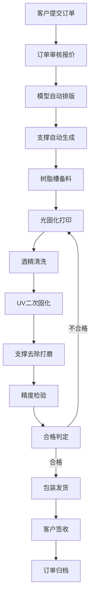

## 1. 产品概述

3D打印服务工厂SLA树脂打印业务管理系统，面向SLA光固化打印工厂，提供从在线接单到成品交付的全流程数字化管理。解决传统工厂人工排单效率低、工艺参数不统一、质量追溯困难等问题，实现打印工厂的标准化、可视化、智能化运营。

- 目标用户：3D打印工厂操作员、生产主管、业务经理、客户
- 核心价值：全流程数字化管控、工艺标准化、质量可追溯、生产效率提升

## 2. 核心功能

### 2.1 用户角色

| 角色 | 注册方式 | 核心权限 |
|------|----------|----------|
| 工厂管理员 | 后台注册 | 全部功能、用户管理、数据统计 |
| 生产操作员 | 管理员添加 | 生产流程操作、设备监控 |
| 业务经理 | 管理员添加 | 订单管理、客户对接、报价审核 |
| 客户 | 自助注册 | 在线下单、进度查询、订单管理 |

### 2.2 功能模块

1. **在线接单**：客户在线下单、订单审核、报价管理、订单跟踪
2. **模型摆放**：3D模型预览、自动摆放优化、支撑自动生成、打印排版
3. **树脂备料**：树脂槽液位监控、树脂类型管理、备料计划、材料消耗统计
4. **光固化打印**：分层切片参数设置、曝光时间控制、打印平台升降、实时监控
5. **清洗固化**：酒精清洗流程、二次固化参数、清洗时间控制、设备状态
6. **支撑去除**：支撑剥离工序、打磨工艺、表面精度检验、质量判定
7. **成品交付**：质检报告、包装管理、物流邮寄、客户签收、订单归档

### 2.3 页面详情

| 页面名称 | 模块名称 | 功能描述 |
|----------|----------|----------|
| 仪表盘 | 数据概览 | 今日订单量、设备状态、生产进度、材料库存统计卡片 |
| 在线接单 | 订单列表 | 订单筛选、状态标签、批量操作、快捷搜索 |
| 在线接单 | 新建订单 | 客户信息、模型上传、打印参数、数量报价、备注说明 |
| 在线接单 | 订单详情 | 订单全流程时间线、模型预览、操作记录、沟通消息 |
| 模型摆放 | 打印排版 | 3D打印平台视图、模型拖拽、自动摆放算法、旋转缩放 |
| 模型摆放 | 支撑生成 | 支撑参数配置、自动生成支撑、支撑预览编辑 |
| 树脂备料 | 树脂管理 | 树脂类型、库存数量、有效期、供应商信息 |
| 树脂备料 | 槽位监控 | 各设备树脂槽液位、温度、实时状态、补料提醒 |
| 光固化打印 | 打印任务 | 任务队列、设备分配、参数配置、进度条显示 |
| 光固化打印 | 设备监控 | 设备状态、曝光参数、平台高度、温度、打印时长 |
| 清洗固化 | 清洗工位 | 清洗篮管理、清洗时间、酒精浓度、工位状态 |
| 清洗固化 | 固化工位 | UV固化参数、时间控制、温度、固化进度 |
| 支撑去除 | 工序管理 | 待处理列表、操作人员、工时记录、打磨工具 |
| 支撑去除 | 精度检验 | 尺寸测量、表面粗糙度、缺陷记录、质检评分 |
| 成品交付 | 包装发货 | 包装清单、物流单号、快递公司、发货确认 |
| 成品交付 | 订单归档 | 电子签收、客户评价、文件归档、数据统计 |

## 3. 核心流程

客户通过系统提交3D打印需求，上传模型文件并选择打印参数。业务经理审核订单并确认报价后，订单进入生产环节。生产操作员将模型自动排版到打印平台，系统生成支撑结构。操作员确认树脂槽备料充足后，启动光固化打印，系统控制分层曝光和平台升降。打印完成后，工件进入酒精清洗工位去除残留树脂，再进行UV二次固化。随后去除支撑并打磨，检验表面精度。质检合格后，成品包装并通过物流邮寄给客户，客户确认签收后订单归档。

## 4. 用户界面设计

### 4.1 设计风格

- **主色调**：工业蓝 #0EA5E9（代表科技与精密），辅以琥珀橙 #F59E0B（代表光固化与警示）
- **背景色**：深灰 #0F172A 为基底，营造工业控制中心氛围
- **按钮风格**：硬朗直角带微圆角，按下有凹陷效果，主按钮带发光边框
- **字体**：标题使用 Space Grotesk（几何工业感），正文使用 IBM Plex Mono（等宽数据感）
- **布局风格**：左侧导航栏 + 顶部状态栏 + 主内容区卡片式布局，数据仪表盘采用网格化
- **图标风格**：Lucide 线性图标，配合工业设备象形符号

### 4.2 页面设计概览

| 页面名称 | 模块名称 | UI元素 |
|----------|----------|--------|
| 仪表盘 | 数据概览 | 霓虹发光数据卡片、设备状态指示灯、环形进度图、渐变柱状图 |
| 订单列表 | 在线接单 | 表格带斑马纹、状态胶囊标签、行悬停高亮、批量选择复选框 |
| 打印排版 | 模型摆放 | 3D视图画布、网格底板、模型轮廓线、尺寸标注、工具栏浮层 |
| 设备监控 | 光固化打印 | 模拟设备面板、数值仪表、进度条带发光效果、实时数据刷新动画 |
| 工序工位 | 清洗固化 | 工位卡片网格、状态色边框、倒计时显示、进度环 |
| 质检页面 | 支撑去除 | 表单分组卡片、评分星标、缺陷标记、测量数据输入框 |
| 发货页面 | 成品交付 | 物流时间线、地址卡片、快递选择器、电子签名区 |

### 4.3 响应式

桌面端优先设计（1440px基准），侧栏固定宽度240px；平板端侧栏可折叠为图标模式；移动端底部Tab导航，内容单列自适应。所有触摸目标最小44x44px。

### 4.4 3D场景指导（模型摆放页）

- 环境：深色科技感HDRI，带柔和蓝色环境光
- 灯光：顶部主光 + 两盏侧光，突出模型轮廓和支撑细节
- 相机：透视视角，可轨道旋转、平移、缩放，默认45度俯视角
- 构图：打印平台居中，网格线参考，边缘显示可打印边界
- 交互：模型点击选中高亮、拖拽移动、滚轮缩放、右键旋转
- 后处理：模型边缘抗锯齿、轻微辉光效果、平台阴影
- 资产：使用基础几何体模拟，性能目标60fps
