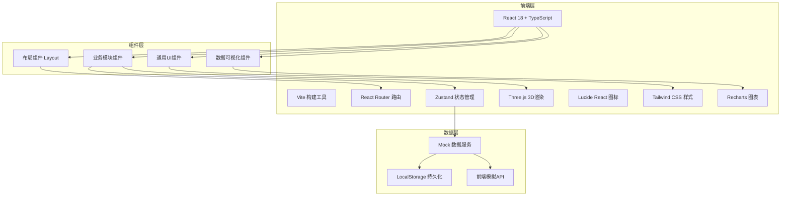
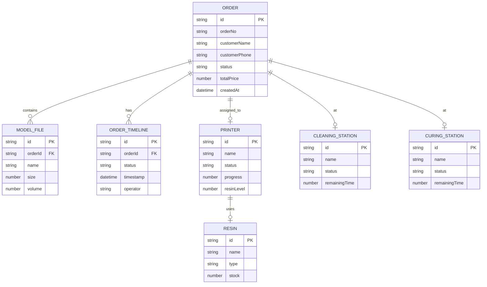

## 1. 架构设计



## 2. 技术描述

- **前端框架**: React@18 + TypeScript@5
- **构建工具**: Vite@5
- **样式方案**: Tailwind CSS@3（自定义工业风主题）
- **状态管理**: Zustand@4（轻量级状态管理，跨组件数据共享）
- **路由管理**: React Router DOM@6
- **图标库**: Lucide React（线性工业风格图标）
- **3D渲染**: Three.js + @react-three/fiber + @react-three/drei（模型摆放模块3D视图）
- **图表可视化**: Recharts@2（生产数据仪表盘）
- **后端**: 无后端，纯前端Mock数据模拟API
- **数据持久化**: LocalStorage存储订单状态和用户偏好

## 3. 路由定义

| 路由 | 页面 | 用途 |
|------|------|------|
| / | Dashboard | 工厂仪表盘，数据概览 |
| /orders | OrderList | 在线接单，订单列表 |
| /orders/new | OrderCreate | 新建订单 |
| /orders/:id | OrderDetail | 订单详情 |
| /layout | ModelLayout | 模型摆放排版 |
| /resin | ResinPrep | 树脂备料管理 |
| /print | PrintControl | 光固化打印控制 |
| /cleaning | CleaningCuring | 清洗固化工序 |
| /support | SupportRemoval | 支撑去除与质检 |
| /delivery | Delivery | 成品交付发货 |

## 4. API定义（前端模拟）

```typescript
// 订单类型定义
interface Order {
  id: string;
  orderNo: string;
  customerName: string;
  customerPhone: string;
  customerEmail: string;
  modelFiles: ModelFile[];
  materialType: string;
  layerHeight: number;
  quantity: number;
  unitPrice: number;
  totalPrice: number;
  status: 'pending' | 'reviewed' | 'layout' | 'printing' | 'cleaning' | 'support' | 'qc' | 'shipping' | 'completed';
  createdAt: string;
  updatedAt: string;
  remark: string;
  timeline: OrderTimeline[];
}

interface ModelFile {
  id: string;
  name: string;
  size: number;
  url: string;
  dimensions: { x: number; y: number; z: number };
  volume: number;
  hasSupports: boolean;
}

interface OrderTimeline {
  status: string;
  timestamp: string;
  operator: string;
  remark: string;
}

// 设备类型定义
interface Printer {
  id: string;
  name: string;
  model: string;
  status: 'idle' | 'printing' | 'paused' | 'maintenance';
  currentOrderId?: string;
  progress: number;
  resinLevel: number;
  resinType: string;
  platformHeight: number;
  temperature: number;
  exposureTime: number;
  layerHeight: number;
  totalLayers: number;
  currentLayer: number;
  printDuration: number;
  elapsedTime: number;
}

interface CleaningStation {
  id: string;
  name: string;
  status: 'idle' | 'cleaning' | 'completed';
  orderId?: string;
  alcoholConcentration: number;
  cleaningTime: number;
  remainingTime: number;
  basketId?: string;
}

interface CuringStation {
  id: string;
  name: string;
  status: 'idle' | 'curing' | 'completed';
  orderId?: string;
  uvIntensity: number;
  temperature: number;
  curingTime: number;
  remainingTime: number;
}

// 树脂类型定义
interface Resin {
  id: string;
  name: string;
  type: string;
  color: string;
  manufacturer: string;
  stock: number;
  unit: string;
  expiryDate: string;
  pricePerUnit: number;
}
```

## 5. 数据模型


